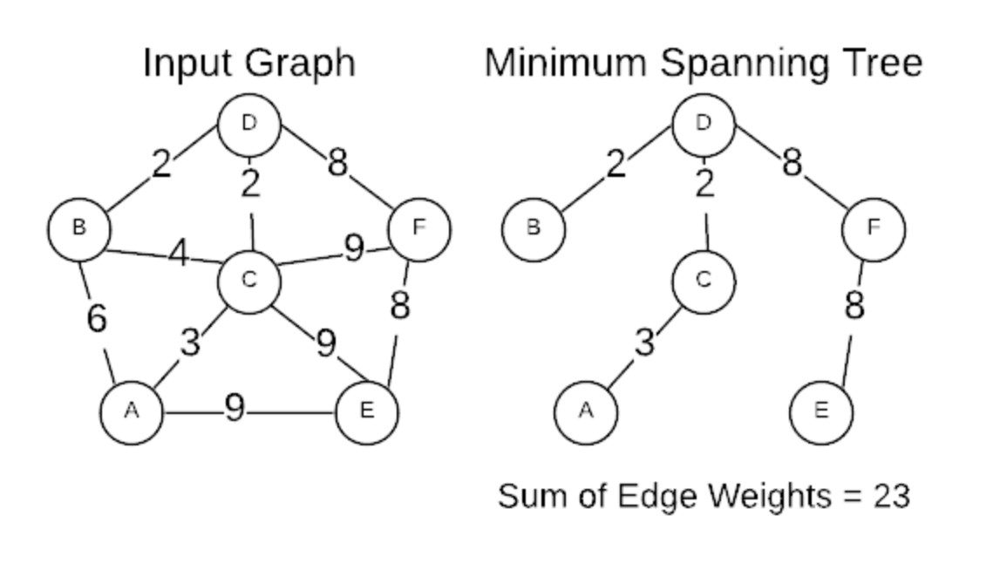
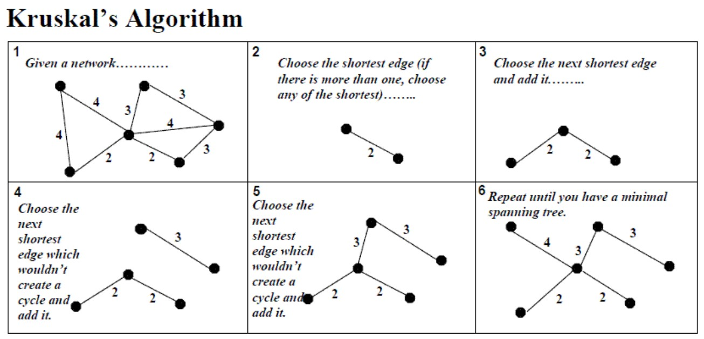
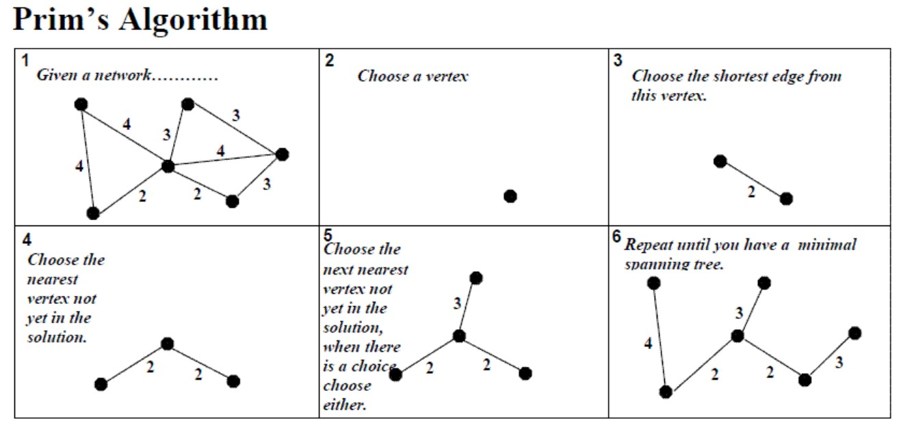

## 최소 신장 트리(MST : Minimun Spanning Tree)

- 그래프에서의 최소 비용 문제
  1. 모든 정점을 연결하는 간선들의 가중치의 합이 최소가 되는 트리
  2. 두 정점 사이의 최소 비용의 경로 찾기
- 신장 트리
  - n개의 정점으로 이루어진 무향 그래프에서 n개의 정점과 n-1개의 간선으로 이루어진 트리
- 최소 신장 트리(MST)
  - 무향 가중치 그래프에서 신장 트리를 구성하는 **간선들의 가중치의 합이 최소인 신장 트리**
  - 고립된 노드 없이 모든 노드가 모두 연결 되어야 함
  
- 어떻게 만들 수 있을까?
  1.  완전탐색 : E개 중에 n-1개의 간선 선택 => eEn-1 => 매우 큰 수
  2.  **Greedy** : 완전 탐색으로 하면 매우 큰 수가 되므로 탐욕적인 방법으로 만들기
      - Kruskal
      - Prim
- MST는 비용을 구함(경로 X), 최소비요이 같다면 시작점에 따라 여러 경로로 나올 수 있음
  <br/>

## KRUSKAL 알고리즘



- 간선을 하나씩 선택해서 MST를 찾는 알고리즘
  1.  최초, 모든 간선을 **가중치에 따라 오름차순**으로 **정렬**
  2.  가중치가 가장 낮은 간선부터 선택하면서 트리 증가 시킴
      - 단, 사이클이 존재하면 선택한 간선은 사용하지 않고, 그 다음으로 가중치가 낮은 간선 선택
      - union의 결과가 false면 즉, 대표자가 같으면 간선 선택하지 않음
  3.  n-1개의 간선이 선택될 때까지 2번을 반복
      - union 횟수가 간선과 같아지면 (n-1)이 되면 끝
- **간선** 중심 : 간선 리스트 이용
- 코드

  ```java
  import  java.io.BufferedReader;
  import  java.io.IOException;
  import  java.io.InputStreamReader;
  import  java.util.Arrays;
  import  java.util.StringTokenizer;

  /*
  5 10
  0 1 5
  0 2 10
  0 3 8
  0 4 7
  1 2 5
  1 3 3
  1 4 6
  2 3 1
  2 4 3
  3 4 1
  output => 10
  */

  public  class  MST1_KruskalTest  {
  	static  class  Edge  implements  Comparable<Edge>{

  		int start, end, weight;

  		public  Edge(int  start,  int  end,  int  weight)  {
  			this.start = start;
  			this.end = end;
  			this.weight = weight;
  		}

  		@Override
  		public  int  compareTo(Edge  o)  {
  			return  this.weight - o.weight;
  		}
  	}

  	static  int n, parents[];
  	static  Edge[] edgeList;

  	// 단위 집합 생성
  	public  static  void  makeSet()  {
  		parents =  new  int[n];
  		// 자신의 부모노드를 자신의 값으로 세팅
  		for(int i =  0; i < n; i++)  {
  			parents[i]  = i;
  			//parents[i] = -1 => 나중에 -1만 새면 집단 개수 확인 가능
  		}
  	}

  	// a의 집합 찾기 : a의 대표자 찾기
  	public  static  int  findSet(int  a)  {
  		// 스스로가 대표자 일 때
  		if(a == parents[a])  return a;
  		// path compression
  		// 찾은 루트 노드로 부모 바꾸기
  		return parents[a]  =  findSet(parents[a]);
  		// parents[a] = findSet(a) => 이렇게 쓰면 실수! 무한 루프
  	}

  	// a, b 두 집합 합치기
  	// 합쳐진다면 true, 합치지 못한다면 false
  	public  static  boolean  union(int  a,  int  b)  {
  		int aRoot =  findSet(a);
  		int bRoot =  findSet(b);
  		// 같은 집합이므로 합칠 수 없음
  		if(aRoot == bRoot)  return  false;
  		// parents[b] = a; => path compression 의미 전혀 없음 이렇게 쓰면 안됨
  		parents[bRoot]  = aRoot;  // 루트끼리 합쳐야함
  		return  true;
  	}

  	public  static  void  main(String[]  args)  throws  IOException  {
  		BufferedReader br =  new  BufferedReader(new  InputStreamReader(System.in));
  		StringTokenizer st =  new  StringTokenizer(br.readLine());
  		n = Integer.parseInt(st.nextToken());
  		int e = Integer.parseInt(st.nextToken());
  		edgeList =  new  Edge[e];

  		// 입력 받기
  		for(int i =  0; i < e; i++)  {
  			st =  new  StringTokenizer(br.readLine());

  			int start = Integer.parseInt(st.nextToken());
  			int end = Integer.parseInt(st.nextToken());
  			int weight = Integer.parseInt(st.nextToken());
  			edgeList[i]  =  new  Edge(start, end, weight);
  		}

  		Arrays.sort(edgeList);  // 간선비용의 오름차순 정렬

  		makeSet();

  		int result =  0;  // 결과 비용
  		int cnt =  0;  // 유니온 몇 번 했는지 (n-1)이 되면 종료

  		for(Edge edge : edgeList)  {  // 간선 하나씩 꺼내기
  			if(union(edge.start, edge.end)){
  				result += edge.weight;
  				if(++cnt == n-1)  break;
  			}
  		}

  		System.out.println(result);  // 최소 비용
  	}

  }
  ```

<br/>

## PRIM 알고리즘



- 하나의 정점에서 연결된 간선들 중에 하나씩 선택하면서 MST를 만들어가는 방식
  1.  임의 정점을 하나 선택해서 시작
  2.  선택한 정점과 인접하는 정점들 중의 최소 비용의 간선이 존재하는 정점을 선택
  3.  모든 정점이 선택될 때 까지 1, 2과정을 반복
- 서로소인 2개의 집합 정보를 유지
  - 트리 정점들(tree vertices) : MST를 만들기 위해 선택된 정점들
  - 비트리 정점들(non-tree vertices) : 선택되지 않은 정점들
- **정점** 중심 : 인접행렬, 인접 리스트 이용
- 코드

```java
import  java.io.BufferedReader;
import  java.io.IOException;
import  java.io.InputStreamReader;
import  java.util.StringTokenizer;

/*
5
0 5 10 8 7
5 0 5 3 6
10 5 0 1 3
8 3 1 0 1
7 6 3 1 0
output => 10
*/

public  class  MST2_PrimTest  {
	public  static  void  main(String[]  args)  throws  IOException  {
		BufferedReader br =  new  BufferedReader(new  InputStreamReader(System.in));
		int n = Integer.parseInt(br.readLine());
		StringTokenizer st;

		int[][] adjMatrix =  new  int[n][n];
		int[] minEdge =  new  int[n];  // 타정점에서 자신으로의 간선 비용 중 최소비용 저장

		boolean[] visitied =  new  boolean[n];  // 신장트리에 선택된 여부

		for(int i =  0; i < n; i++)  {
			st =  new  StringTokenizer(br.readLine());
			for  (int j =  0; j < n; j++)  {
				adjMatrix[i][j]  = Integer.parseInt(st.nextToken());
			}

			minEdge[i]  = Integer.MAX_VALUE;  // 충분히 큰 값으로 초기화
		}

		int result =  0;  // MST 비용
		minEdge[0]  =  0;  // 시작 정점 0의 최소비용 0처리 => 임의의 시작값 (어떤 정점에서 시작해도 동일한 결과값 나옴)

		for(int i =  0; i < n; i++)  {  // n개의 정점 모두 연결

			// 1. 신장트리에 연결되지 않는 정점 중 가장 유리한 비용의 정점을 선택
			int min = Integer.MAX_VALUE;
			int minVertex =  -1;
			for(int j =  0; j < n; j++)  {
				if(!visitied[j]  && min > minEdge[j])  {
					min = minEdge[j];
					minVertex = j;
				}
			}

			// 2. 선택된 정점 신장트리에 포함
			visitied[minVertex]  =  true;
			result += min;

			// 3. 선택 된 정점 기준으로 신장트리에 포함되지 않은 다른 정점으로의 간선 비용 따져보고 최소값 갱신
			for(int j =  0; j < n; j++)  {
				// !visitied[j] : 아직 방문 하지 않은 점정 중에
				// adjMatrix[minVertex][j] != 0 : 현재 정점과 연결 되어 있고
				// minEdge[j] > adjMatrix[minVertex][j] : 현재의 최소비용보다 선택된 정점에서의 비용이 더 작다면
				// => 최소값 갱신
				if(!visitied[j]  && adjMatrix[minVertex][j]  !=  0  && minEdge[j]  > adjMatrix[minVertex][j])  {
					minEdge[j]  = adjMatrix[minVertex][j];
				}
			}
		}

		System.out.println(result);

	}
}
```

<br/>

### PRIM WITH PQ

- 원래 PQ는 리스트를 써야 시간 복잡도가 줄어드는게 눈에 띄지만, 왜인지 행렬에서도 PQ를 쓰는게 더 빠른 경우가 많으니 PQ를 사용해보자
- PRIM 알고리즘은 V^2의 시간 복잡도를 가지지만 PQ를 사용하면 VlogV로 줄일 수 있음
- 코드

  ```java
  import java.util.Arrays;
  import  java.util.PriorityQueue;
  import  java.util.Scanner;

  /*
  5
  0 5 10 8 7
  5 0 5 3 6
  10 5 0 1 3
  8 3 1 0 1
  7 6 3 1 0
  output==>10

  7
  0 32 31 0 0 60 51
  32 0 21 0 0 0 0
  31 21 0 0 46 0 25
  0 0 0 0 34 18 0
  0 0 46 34 0 40 51
  60 0 0 18 40 0 0
  51 0 25 0 51 0 0
  output==>175
   */


  public class MST_PrimWithPQ {
  	// PQ에 들어갈 데이터 타입
  	static class Data implements Comparable<Data>{
  		int vertex;
  		int weight;

  		public Data(int vertex, int weight) {
  			super();
  			this.vertex = vertex;
  			this.weight = weight;
  		}

  		@Override
  		public String toString() {
  			return "Data [vertex=" + vertex + ", distance=" + weight + "]";
  		}

  		@Override
  		public int compareTo(Data o) {
  			// return this.weight - o.weight; => MAX_VALUE - MIN_VALUE 하면 연산자 뒤바뀜
  			return Integer.compare(this.weight, o.weight); // 습관화 하자
  		}
  	}

  	public static void main(String[] args) {
  		Scanner sc = new Scanner(System.in);
  		int N = sc.nextInt();

  		int[][] map = new int[N][N];

  		for(int i =0; i < N; i++) {
  			for(int j = 0; j < N; j++) {
  				map[i][j] = sc.nextInt();
  			}
  		}

  		int res = 0;
  		// 신장트리에 포함여부 판단 배열
  		boolean[] v = new boolean[N];
  		// 다른 정점에서 자신으로의 최소비용을 저장하는 배열 공간 선언 및 최대값으로 초기화
  		// 임의의 정점을 시작점부터 발생하기 위함 처음 방문하는 지점 최소비용(0)으로 초기화
  		PriorityQueue<Data> pq = new PriorityQueue<>(); // minEdge 대신 pq 사용
  		pq.offer(new Data(0, 0)); // 임의의 정점, 이 정점부터 시작하기 위해 0으로 초기화

  		// O(NlogN)
  		Data cur = null;
  		int cnt = 0; // 가지치기 => MST는 정점 N개일 때 N-1개만 선택되면 됨

  		while(!pq.isEmpty()) {
  			// 1.신장트리에 연결되지 않은 정점중에서 가장 유리한 정점을 선택 => pq poll => logV
  			cur = pq.poll();
  			if(v[cur.vertex]) continue; // 이미 최소값으로 처리된 정점이 중복되어 나온경우 배제

  			// 2. 선택된 정점을 신장트리에 포함 시킴
  			v[cur.vertex] = true;
  			// 그때 선택된 정점에 대한 최소 비용을 결과값에 저장
  			res += cur.weight;
  			cnt++;

  			if(cnt == N) { // N-1하면 안됨, 간선이 N-1개 정점은 N개 선택
  				break;
  			}

  			// 3. 방금 선택된 정점 기준으로 신장트리에 포함되지 않은 정점으로 연결된
  			//   간선비용을 따져봐서 최소비용을 업데이트 함
  			//   (이 부분이 정렬하지 않고 최소값으로 찾기 만으로 다음 정점을 선택함)
  			for(int i = 0; i < N; i++) {  // 인접리스트로 변경
  				// 신장트리에 포함된 정점은 제외
  				if(v[i]) {
  					continue;
  				}

  				// 연결되지 않은 정점은 무시
  				if(map[cur.vertex][i] == 0) { // 인접리스트
  					continue;
  				}

  				// 새로 연결된 정점에서 갈 수 있는 비용들 삽입
  				// pq가 알아서 정렬하므로 비교하지 않고 무조건 삽입
  				// => 그래서 같은 정점에 대한 weight가 여러개 들어갈 수 있음
  				// => 하지만 weight로 정렬되므로 상관 없음
  				// => 메모리 초과 난다면 기존 코드 쓸 것
  				pq.offer(new Data(i, map[cur.vertex][i]));

  			}
  		}
  		// MST값 출력
  		System.out.println(res);

  	}
  }
  ```

## Q. 어떤 알고리즘을 써야할까?

- 정점수, 간선수에 따라 달라짐
- 간선이 너무 많을 때는 KRUSKAL을 사용할 수 없음
  - 정렬이 NlogN이므로, n-1개의 간선을 정렬하는데만 N^2
- 간선이 적으면 KRUSKAL, 간선이 많으면 PRIM

참고 및 이미지 :  
https://hideoushumpbackfreak.com/algorithms/graph-min-span-tree  
https://stackoverflow.com/questions/1195872/when-should-i-use-kruskal-as-opposed-to-prim-and-vice-versa
