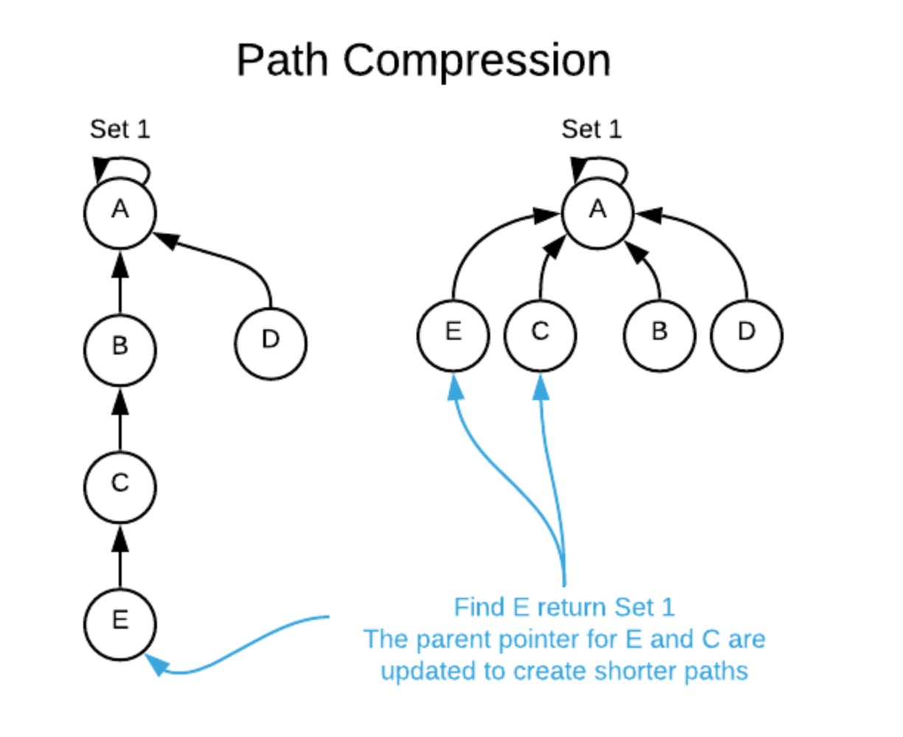

## 서로소 집합(Disjoint-set)
- 서로소 또는 상호배타 집합들은 서로 중복 포함된 원소가 없는 집합을 뜻함 : 교집합 X
- 집합에 속한 하나의 특정 멤버를 토해 각 집합들을 구분, 이를 대표자(representative)라고 함
- 서로소 집합을 표현하는 방법
	- 연결 리스트
		- 같은 집합들의 원소들은 하나의 연결리스트로 관리
		- 연결 리스트의 맨 앞 원소를 집합의 대표 원소로 삼음
		- 각 원소는 집합의 대표 원소를 가리키는 **링크**를 가짐
	- 트리
		- 같은 집합의 원소들을 하나의 트리로 표현
		- 자식 노드가 부모 노드를 가리키며 루트 노드가 대표자가 됨 
- 서로소 집합 연산
	1. makeSet(x) : 최소 단위 집합 생성
	2. findSet(x) : x가 속한 집합 찾기 => x가 속한 집합의 대표자 찾기
	3. unio(x,y) : x, y가 속한 집합 합쳐 하나의 집합 만들기 => **서로소 집합 유지**
- 연산의 효율을 높이는 방법
	1. Rank를 이용한 Union
		- 각 노드는 자신을 루트로 하는 subtree의 높이를 rank로 저장
		- 두 집합을 합칠 때 rank가 낮은 집합을 rank가 높은 집합에 붙임
	2. Path compression
		- findSet을 하는 과정에서 만나는 모든 노드들이 직접 루트를 가리키도록 포인터를 바꾸어주기
		
<br/> 
- 코드
	1. makeSet
	```
	// 단위 집합 생성
	public  static  void  makeSet()  {
		parents =  new  int[n];
		// 자신의 부모노드를 자신의 값으로 세팅
		for(int i =  0; i < n; i++)  {
			parents[i]  = i;
			//parents[i] = -1 => 나중에 -1만 새면 집단 개수 확인 가능
		}
	}
	```

	2. findSet
	```
	// a의 집합 찾기 : a의 대표자 찾기
	public  static  int  findSet(int  a)  {
		// 스스로가 대표자 일 때
		if(a == parents[a])  return a;
		
		// path compression
		// 찾은 루트 노드로 부모 바꾸기
		return parents[a]  =  findSet(parents[a]);
		// parents[a] = findSet(a) => 이렇게 쓰면 실수! 무한 루프
	}
	```

	3. union
	```
	// a, b 두 집합 합치기
	// 합쳐진다면 true, 합치지 못한다면 false
	public  static  boolean  union(int  a,  int  b)  {

		int aRoot =  findSet(a);
		int bRoot =  findSet(b);

		// 같은 집합이므로 합칠 수 없음
		if(aRoot == bRoot)  return  false;
		
		// parents[b] = a; => path compression 의미 전혀 없음 이렇게 쓰면 안됨
		parents[bRoot]  = aRoot;  // 루트끼리 합쳐야함
		return  true;
	}
	```

참고 및 이미지 : 
https://hideoushumpbackfreak.com/algorithms/data-struct-union-find
