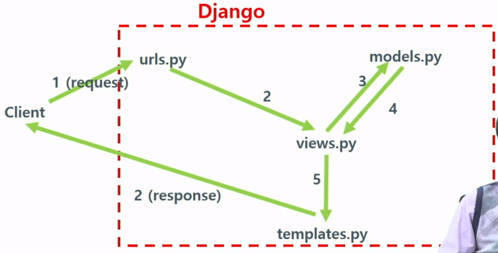

# BigData(추천)
- notion : https://www.notion.so/BigData-76290a3430d4434f83661ee042f585cb
# Recommender Systems 101

[추천 시스템 기본 - (콜라보레이티브 필터링, 컨텐트 베이스 필터링)](http://youtube.com/watch?v=_YndKkun2Sw)

## 1. Collaborative Filtering

- 나와 비슷한 취향의 사람들이 좋아하는 것은 나도 좋아할 확률이 높음 ⇒ **많은 사용자**로부터 얻은 취향 정보 이용
- 유사한 사용자(User)나 아이템(Item) 이용
- `Cosine Similarity`나 `Pearson Correlation` 사용 (KNN도 포함)
- 장점 : 쉽게 만들 수 있음 / 도메인에 의존적이지 않음 / 결과를 설명하기 쉬움
- 단점 : 데이터 축적 X, Sparse한 경우 성능 낮음 / 데이터 많아질수록 속도 저하


- 유사도 측정


### (1) User based

- 특정 사용자(User) 선택 후 평점 유사도를 기반으로 유사한 사용자들을 찾아 유사한 사용자가 좋아한 아이템 추천

### (2) Item based

- 특정 아이템(Item) 선택 후 특정 아이템을 좋아한 사용자들을 찾아 그 사용자들이 공통적으로 좋아했던 다른 아이템 추천


## 2. Content Based Filtering

- 아이템에 대한 메타 데이터를 이용해 어떤 사람이 특정 아이템을 선호한다면, 그것과 비슷한 아이템을 추천하는 방식
- 집합적 정보로 부터 원하는 내용이나 관련된 내용을 가져오는 `Information retrieval` 과 필요없는 정보를 제공하는 `Information filtering`에 뿌리를 두고 있음
- 아이템의 특징(키워드, 피쳐)을 끌어내기위해 `TF-IDF` 사용
- 장점 : 사용자가 평점을 매기지 않은 새로운 아이템이 들어와도 추천 가능
- 단점 : 기존 아이템과 유사한 아이템 위주 추천 / 새로운 장르 아이템 추천 어려움 / 아이템 피쳐 추출 어려움

<br>

## 3. Hybrid Recommandation Systems

- 추가 예정

출처 및 참고 :    
[https://medium.com/@toprak.mhmt/collaborative-filtering-3ceb89080ade](https://medium.com/@toprak.mhmt/collaborative-filtering-3ceb89080ade)  
[https://medium.com/@toprak.mhmt/content-based-recommender-system-bdfc60b1bee8](https://medium.com/@toprak.mhmt/content-based-recommender-system-bdfc60b1bee8)
[https://kmhana.tistory.com/31](https://kmhana.tistory.com/31)  
[https://velog.io/@isseebx/Contents-Based-Filtering-Collaborative-Filtering](https://velog.io/@isseebx/Contents-Based-Filtering-Collaborative-Filtering)  
[https://heung-bae-lee.github.io/2019/12/14/Recommendation_System_00/](https://heung-bae-lee.github.io/2019/12/14/Recommendation_System_00/)  
<br>
<br>
<br>
# 1강_프로젝트 기초

## 개발환경

- [Anaconda 설치](http://www.anaconda.com/distribution/)
- Anaconda Prompt에서 Django 설치
    - `pip install Django`
- Python 환경을 위한 virtualenvwrapper 설치
    - `pip install virtualenvwrapper`
- 프로젝트 다운 후 해당 폴더에서 실행
    - `python [manage.py](http://manage.py) migrate`
    - `python [manage.py](http://manage.py) runserver`

## Django 흐름도 설명 및 기본 문법

1. 클라이언트 요청은 Django 프로젝트의 디렉토리 안에 있는 urls.py에 전달
2. urls.py에서 요청을 views.py로 보내고 저장되어 있는 데이터가 필요하면 models.py에서 가져와 templates로 보내면 클아이언트에게 응답하게 됨




> 💡 Django view 공식 문서 : [https://docs.djangoproject.com/ko/4.1/intro/tutorial03/](https://docs.djangoproject.com/ko/4.1/intro/tutorial03/)  
Context : 템플릿에서 쓰이는 변수명과 Python 객체를 연결하는 사전형 값


### urls.py

- Django의 뷰에서 ` 템플릿 태그를 사용하면 urls.py에서 설졍된 URL의 정의를 탐색하여 처리

```python
urlpatterns = [
        path('', views.index, name='index'),
        path('train', views.train_view, name='train'),
        path('train_model', views.train_model, name='train_model'),

        path('recomm', views.recomm_main_view, name='recomm'),
        path('recomm/<int:user_id>', views.recomm_user, name='recomm_result'),
        ]
```

-  일 때, train은 views.train_view라고 지정 되어 [views.py](http://views.py) 파일의 train_view 실행
    
    `<a href="">Train Model</a>` 
    

### index()

```python
def index(request):
    return render(request, 'movieRec/base.html', {})
```

- render() 뷰에 `movieRec/base.html` 템플릿 전달
- `render(request 객체, 템플릿 이름, context 사전형 객체(Optional))`
- 인수로 지정된 context로 표현된 템플릿의 HttpResponse 객체 반환

### train_view()

```python
def train_view(request):
    context = {}
    context['train_finished'] = False
    return render(request, 'movieRec/train.html', context)
```

- context 사전을 만들고 trains_finished 키에 대한 값을 False로 저장 후 render() 함수 호출

### run_kNN()

```python
def run_kNN(request):
    k = request.POST.get('param_k')
    os.system('cd matrixfactorization& python train.py -i data/tiny -o result/tiny -a 0 -k %s'%k)
    load_result('matrixfactorization')
```

- `[request.POST](http://request.POST)` 함수를 이용해 KNN에서 사용할 이웃 고객 인원 수 파라미터 k 값 가져옴
- 커맨드 라인에서 [train.py](http://train.py) 실행
    - `-i` : 데이터 파일 디렉토리
    - `-o` : 결과 파일 디렉토리
    - `-a` 0 : knn 학습 알고리즘
    - 파라미터로 넘어온 값 k를 String으로 바꾸어 실행할 수 있게 해줌
    - 작은 데이터를 쓰기위해 이 코드는 tiny로 사용 (그래야 돌아갈 수 있다?)
- `load_result` 로 결과 저장 ⇒ SQLite3 DB

## DB 예시

```python
from django.db import models

class User(models.Model):
    id = models.IntegerField(primary_key=True)
    name = models.CharField(max_length=100)
```
<br>
<br>
<br>

# 2강_KNN

## Recommend() 함수

- 추천 알고리즘이 학습 데이터로 평점 행렬과 예측 평점 행렬을 train_ratings.txt와 recommend_ratings.txt 파일로 저장함
    - 모든 고객에 대해서 **보지 않은 영화들에 대해서만 예측 평점 계산**해 recommend_ratings.txt로 저장

```python
def recommend(R_train, R_predicted, item_ids, output_path)
```

- 파라미터
    - R_train : 학습 데이터 평점 행렬
    - R_predicted : 각 고객마다 추천 알고리즘이 예측한 모든 영화에 대한 평점 행렬
    - items_ids : 영화 아이디 리스트
        - 선택된 고객에 추천하려면 영화 id가 아닌 실제 영화 제목을 보여줘야하므로 필요
    - output_path : 추천 결과를 저장할 디렉토리
        - train_ratings.txt와 recommend_ratings.txt 파일 저장
        - user-id::movie-id::predicted-rating 형태로 저장
- 평점 행렬 R과 R_train, R_predicted는 **Compressed Spare Row(CSR) Matrix 형태로 저장**
    - CSR : **0이 아닌 값들만 저장**
    - R_trina 행렬에서 고객들이 시청한 영화의 평점들은 R_predicted에서 모두 0으로 변경
        - TOP-K를 뽑으면 자기자신이 본 영화는 다 빠지게 됨
    - CSR Matrix
    
    ```python
    import numpy as np
    from scipy.sparse import csr_matrix
    
    # 예시 행렬, 0이 아닌 값을 가진 행, 렬 저장
    # 1 0 2
    # 0 0 3
    # 4 5 6
    row = np.array([0, 0, 1, 2, 2, 2])
    col = np.array([0, 2, 2, 0, 1, 2])
    data = np.array([1, 2, 3, 4, 5, 6])
    
    matrix = csr_matrix((data, (row, col)), shape = (3, 3))
    print(matrix)
    # (0, 0) 1 
    # (0, 2) 2
    # (1, 2) 3
    # (2, 0) 4
    # (2, 1) 5
    # (2, 2) 6
    
    print(matrix[0].nonzero()[0])
    # [0 0] => 0행에서 0아 아닌 값을 가진 첫번째 행렬 위치는 0, 0임 
    ```
    

### 흐름

1. `R_train.nonzero()`를 호출 해 col, row에 대해서 0이 아닌 값들에 대한 2개의 vector 형태로 리턴 
    - 위의 코드에 적용하면 (0, 0, 1, 2, 2, 2)와 (0, 2, 2, 0, 1, 2)
2. 각 row와 col 변수 쌍 마다 row, item_ids[col], R_train[row, col]을 train_ratings.txt에 저장 
    - item_ids[col]은 실제 영화 이름
    - R_predicted 행렬에서 R_train[row, col]에 있는 평점을 0으로 변환 (시청하지 않은 영화에 대해서만 추천하기 위함)
3. for문 수행 후 변경되 R_predicted 행렬을 rocommend_ratings.txt에 저장 

## KNN 추천 알고리즘

- 고객마다 가장 비슷한 K명의 다른 고객을 선택하고, 이 고객이 아직 보지 않은 영화마다 그 K명의 가장 유사한 고객들의 평점을 종합해서 평점을 계산
    - K는 홀수로 설정하는 게 더 좋음 (짝수는 k/2 : k/2 상황이 나올 수 있음)
- **유사도가 아주 높은 고객이 부여한 평점은 그 평점을 높게 반영, 유사도가 낮으면 가중치를 낮춰 반영**
- 고객이 평점을 주지 않았던 영화들 중 평점이 가장 높은 영화들을 추천

### 장단점

- 장점
    - 단순하여 구현이 쉽고 효율적임
    - 기저 데이터 분포에 대한 가정을 하지 않음
    - 훈련 데이터를 그대로 가지고 있으므로 훈련 단계가 매우 빠름
        - 특별한 훈련을 하지 않음(Lazy learning 이라고 표현하기도 함)
    - 수치 기반 분류 작업에서 성능 우수
- 단점
    - 모델을 생성하지 않으므로 특징과 클래스 간의 관계를 이해하는데 제한적
        - 모델의 결과를 가지고 해석하는 것이 아닌, 선험적으로 각 변수와 클래스 간 관계를 파악 후 알고리즘에 적용하여야 원하는 예측 결과를 얻을 수 있음
        - 분석 작업에 시간 소요가 많이 됨
    - 데이터 판별을 위해 적절한 K개의 선택이 필요
    - 훈련 단계가 짧은 대신 예측 단계가 상대적으로 느림
    - 데이터가 많아지면 분류 단계가 느리고, 명목 특징 및 누락 데이터를 위한 추가 처리 필요

### 주의점 : 정규화

- 거리기반 알고리즘이기 때문에 구현 시 변수 값의 범위를 재조정해주어야 함 : **정규화**
    - 변수의 중요도를 고르게 해석할 수 있기 때문
    - ex) A라는 변수의 분포가 1 ~ 10이고, B라는 변수의 분포가 1 ~ 1,000,000이면 각 변수의 차이를 해석하기 어려움 ⇒ B가 함수에 훨씬 더 많은 영향을 미치게 됨
- 정규화
    1. **최소-최대 정규화(min-max normalization)**
    - 변수의 범위를 0%에서 100%까지로 나타냄

        $$ 
        Z=(X−min(X))/(max(X)−min(X))
        $$
        
    1. **z-점수 표준화(z-score standardization)**
    - 변수의 범위를 정규분포화하여 평균을 0, 포준편차가 1이 되도록 함
    - 정규화 값과 달리 미리 정의된 최소값과 최대값이 없음
    - **최소-최대 정규화를 사용하면 데이터셋에서 최소값과 최대값의 범위를 벗어나는 경우가 생겨 z-점수 표준화를 많이 사용**

        $$
        Z=(X−평균)/표준편차
        $$
        

### 적용


- 유저 c1이 시청한 영화는 m2, m4이고 평점으로 각각 5점과 4점을 줌
- 행렬 S는 **유저들의 유사도를 계산**하기 위한 행렬, 행렬 R과 전치행렬 R을 곱해 계산
    - c1과 c3는 시청한 영화 중 겹치는 영화가 없음 ⇒ 계산해도 유사도 0이 나옴
    - 그런데 계산한 값이 저게 맞나?
- 유저 i가 아직 보지 않은 영화 j의 평점을 계산하려고 한다면
    - 유사도가 아주 높은 고객이 부여한 평점은 그 평점을 그대로 반영
    - 유사도가 낮은 고객은 평점 높이 부여해도 가중치를 작게 해 반영
- c1의 m1 예상 평점은 0 * 36 / (36 + 0) + 5 * 0 / (36 + 0) = 0


출처 및 참고 :   
[https://m.blog.naver.com/bestinall/221760380344](https://m.blog.naver.com/bestinall/221760380344) <br>
[https://velog.io/@jhlee508/머신러닝-KNNK-Nearest-Neighbor-알고리즘](https://velog.io/@jhlee508/%EB%A8%B8%EC%8B%A0%EB%9F%AC%EB%8B%9D-KNNK-Nearest-Neighbor-%EC%95%8C%EA%B3%A0%EB%A6%AC%EC%A6%98)
<br>
<br>
<br>

# 3강_Matrix Factorization : 다시 공부 및 정리


- 순서대로 R, U, V 행렬이라고 명명
- Collaborative Filtering 방법론 중 가장 대표적인 방법론
- User-Item Matrix를 F 차원의 User와 Item의 latent factor 행렬곱으로 분해하는 방법
- R행렬(User-Item Matrix)의 많으 부분은 0으로 구성되어 있음, 평점이 있는 부분 중에서 **R을 가장 정확하게 맞출 수 있는 u, v의 행렬**을 찾음


> 💡 **Latent factor : 잠재 변수**  
구성개념(Construct)이 직접적으로 관찰되거나 측정이 되지 않는 변수 의미


출처 및 참고 :     
[https://velog.io/@vvakki_/Matrix-Factorization-2](https://velog.io/@vvakki_/Matrix-Factorization-2)
<br>
<br>
<br>