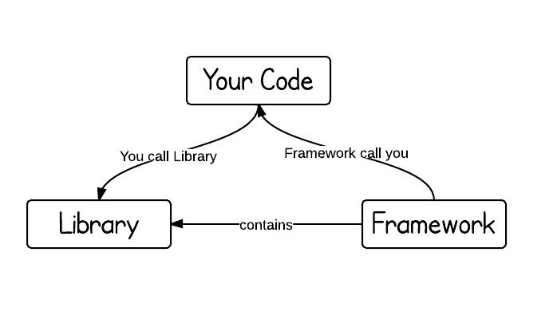

# 프레임워크 VS. 라이브러리
그렇구나 하고 넘어갔던 차이점이 면접에 나오니까 대답을 못하더라. 그럴땐 역시 따로 찾아보는게 맞지 :smile:

## 프레임워크(Framework)
프레임워크는 뼈대나 기반구조를 뜻하고, **제어의 역전 개념이 적용**된 대표적인 기술이다. 소프트웨어에서 프레임워크는 **소프트웨어의 특정 문제를 해결하기 위해서 상호 협력하는 클래스와 인터페이스의 집합**이라고 할 수 있으며 완성된 어플리케이션이 아니라 프로그래머가 완성 시키는 작업을 해야한다.  
객체 지향 개발을 하게 되면서 통합성, 일관성의 부족이 발생되는 문제를 해결할 방법 중 하나라고 할 수 있다.

### 프레임워크의 특징
- 특정 개념들의 추상화를 제공하는 클래스나 컴포넌트로 구성
- 높은 수준에서 패턴 조작화

 

## 라이브러리(Library)
단순 활용 가능한 도구들의 집합을 뜻한다. 개발자가 만든 클래스에서 호출하여 사용하고, 클래스들의 나열로 필요한 클래스를 불러서 사용하는 방식을 가진다

 

## 그래서 이 둘의 차이는?
  
  
라이브러리와 프레임워크의 가장 큰 차이는 **제어의 흐름에 대한 주도성이 어디에 있는가**이다. 즉, 어플리케이션의 `Flow(흐름)을 누가 쥐고 있느냐`에 따라 달려있다.  
프레임워크는 전체적인 흐름을 스스로가 쥐고 있으며 사용자는 그 안에서 필요한 코드를 짜 넣지만, 라이브러리는 사용자가 전체적인 흐름을 만들며 라이브러리를 가져다 쓰는 것이다.  
라이브러리와 달리 프레임워크는 이미 프로그래밍 할 규칙이 정해져 있다. 예를 들어, 설정 파일로 사용되는 XML에 어떤 태그를 써야하고, 어떤 함수를 추가 구현해야하는 등이다.
 

좀 더 쉽게 예를 든 부분이 있어 가지고 와 봤다.
> 라이브러리는 망치, 톱과 같은 연장이다.  사람들이 내리치고, 다시 바꿔들고 썰어야한다.  
>  프레임워크는 차, 비행기와 같은 탈 것이다. 사람이 타서 엔진을 켜고, 핸들을 돌리며 운전하거나 조종한다.   
>  도구를 쓸 때, 급하면 썰어야할 곳에 망치로 내리쳐도 된다. 사람은 도구를 선택하는 입장이기 때문에 어떤 도구를 사용하든 원하는 것을 만들어낼 수만 있으면 된다.   
>  하지만 탈것은 정해진 곳으로만 다녀야 한다. 차를 타고 하늘을 날 수는 없으니까. 그러나 그 목적에 맞게 만들어져 있기 때문에 톱이나 망치를 들고 탈 것을 만들어야할 필요는 없다. 그저 정해진 규칙에 맞춰서 운전을 잘 하기만 하면 된다. 

 

**참고자료** :    
https://webclub.tistory.com/458   
https://anarsolutions.com/difference-between-libraries-frameworks/  

