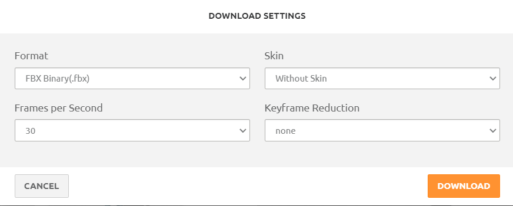
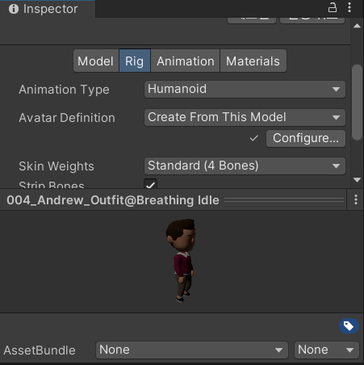
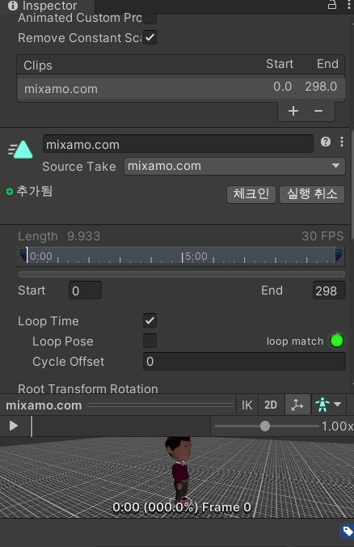
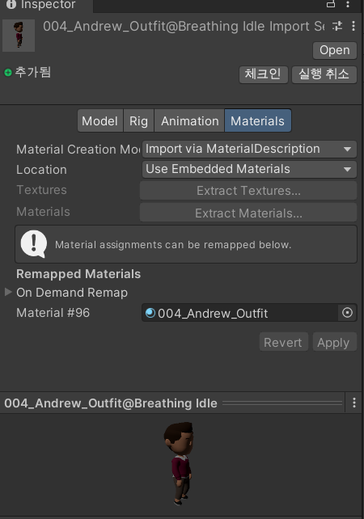
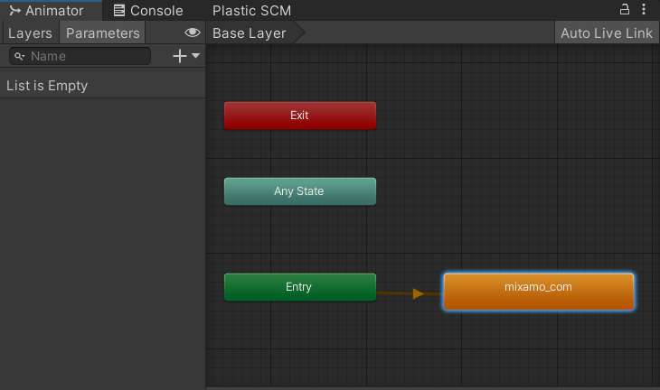
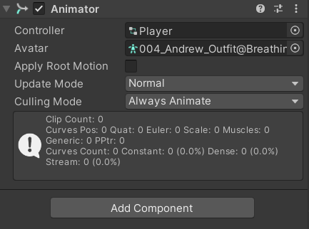

## 기본 모델에 Animator 입히기
- 필요한 것 : T자 모양 기본 모양을 하고 있는 FBX 파일 
1. [https://www.mixamo.com/](https://www.mixamo.com/) 들어가기
2. Animator를 입히고 싶은 캐릭터의 FBX 파일 업로드 후 원하는 애니메이션 선택 
3. 다운로드  
   
4. 다운 받은 파일을 Unity에 드래그앤드랍으로 넣기
5. 설정
	- `Rig` - `Animation Type` - `Humanoid`로 변경  
	  
	- `Animation` - `Loop Time` 체크 & Clips에 다른 효과 제거   
	   
	- `Materials` - 모델의 Material 적용  
	   

6. Animator Controller 생성 후 만든 Animator 넣기 : `Mixamo_com` 이름으로 생성 됨   
  
7. 기존 Prefab을 화면에 넣고 `Controller`, `Avatar` 설정  
  

## 모델 기본 자세 변경
- Play 버튼을 누른 후 원하는 자세에서 일시 정지 
- 해당 오브젝트를 복사 붙여넣기 
- 기존 오브젝트 삭제
- 임시 구현 상태

