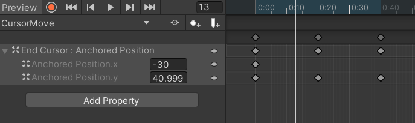
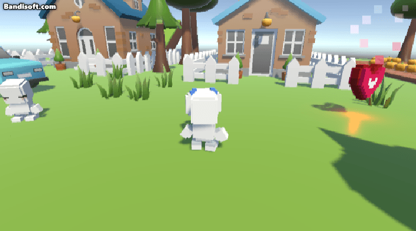

## 대화창 UI
### 1. 기본 대화창 만들기
- `Canvas` 생성 후 도트 이미지를 쓸 것이므로 `Pixel Perfect` 체크 
- 이미지를 늘렸을 때 깨지지 않게 쓰려면 `Image Type`을 `Slice` 옵션으로 변경 할 것
	- Slice 옵션을 사용하려면 `Sprite` 설정 필요 
	- `Sprite Editor` 들어감
	- 변하지 않는 값 설정 위해 `Border` 설정 : L : 3, T : 3, R : 3, B : 5로 여기서는 설정함
	- 이제 크기 변경해도 이미지 깨지지 않음!
- `Anchor` 사용하여 항상 아래쪽에 붙어 있게 설정
	- `Shift` + `Alt` 사용
- `Image` 안에 `Text` 만들고 위치 조정 

### 2. 데이터 전달
- `Create Empty` 생성, GameManager로 변경 
- GameManager.cs 만들기 (GameManager와 연결)
```c#
using System.Collections;
using System.Collections.Generic;
using UnityEngine;
using UnityEngine.UI; // UI 프로그래밍 전에 꼭 먼저 넣기 

public class GameManager : MonoBehaviour
{
    public Text talkText;
    public GameObject scanObject;
    
    public void Action(GameObject scanObj)
    {
        scanObject = scanObj;
        talkText.text = "이것의 이름은 " + scanObject.name + "이라고 한다.";
    }
}
```
- 플레이어에서 매니저 함수를 호출할 수 있게 변수 생성 : `GameManager manager`
- Player에 GameManager.cs 추가 해 준 수 GameManager 꼭 넣어주기 
```c#
	GameObject scanObject;
    void FixedUpdate()
    {
        FreezeRotation();
        StopToObject();

       
        Physics.Raycast(transform.position, transform.forward, out hit);
        if (isObject)
        {

            //Debug.Log(Physics.Raycast(transform.position, transform.forward, out hit,0 LayerMask.GetMask("Object")));
            Debug.Log(hit.collider);
            if (hit.collider != null)
            {
                scanObject = hit.collider.gameObject;
            }
            else
            {
                scanObject = null;
            }

        }
    }
```

### 3. 상태 변경 및 플레이어 이동 제한
```c#
using System.Collections;
using System.Collections.Generic;
using UnityEngine;
using UnityEngine.UI; // UI 프로그래밍 전에 꼭 먼저 넣기 

public class GameManager : MonoBehaviour
{
    public GameObject talkPanel;
    public Text talkText;
    public GameObject scanObject;
    public bool isAction;
    
    public void Action(GameObject scanObj)
    {
        if (isAction) // exit action
        {
            isAction = false;
            talkPanel.SetActive(false);
        }
        else // enter action
        {
            isAction = true;
            talkPanel.SetActive(true);
            scanObject = scanObj;
            talkText.text = "이것의 일름은 " + scanObject.name + "이라고 한다.";
        }

        //talkPanel.SetActive(isAction); // 이렇게 합칠 수도 있음 
       
    }
}
```
- 상태 변수를 사용하여 플레이어 이동을 제한 
- manager의 대화창이 켜졌다면 움직일 수 없음
```c#

    void Update()
    {
        GetInput(); // 제일 위에 작성
        Move();
        Jump();

		// 추가부분
        if (Input.GetButton("Dialogue") && scanObject != null)
        {
            manager.Action(scanObject);
        }
    }
    
    void GetInput()
    {
        hAxis = manager.isAction ? 0 : Input.GetAxisRaw("Horizontal");
        vAxis = manager.isAction ? 0 : Input.GetAxisRaw("Vertical");
        runDown = manager.isAction ? false : Input.GetButton("Run"); // Left Shift 버튼을 꾹 누르고(=>GetButton) 있어야만 달리기 가능 
        jumpDown = manager.isAction ? false : Input.GetButtonDown("Jump"); // Space를 누르는 즉시 점프
    }

```

### 4. 애니메이션
- 대화 창 안에 Image 생성 후 화살표 이미지 넣기(End Cursor)
- `Set Native Size` : 원본 크기대로 이미지 사이즈를 맞춤
- `Animator` 추가 후 `Animator Controller` 생성
- `Animation` 생성(CursorMove)
- Animator에 Move 상태 하나 추가 후 만든 Animation 넣기 
- Window - Animation - End Cursor 클릭 - `Add Property` - `Rect transform` - `Anchored Position`
-  y축의 값을 0:00에 기존 값, 0:20에 40, 0:40에 기존값으로 추가해 줌
 
<br/>

- Animation에 `Loop Time` 체크 

<br/>

## 대화 시스템 구현
### 1. 오프젝트 관리
```c#
using System.Collections;
using System.Collections.Generic;
using UnityEngine;

public class ObjData : MonoBehaviour
{
    public int id;
    public bool isNpc;

}
```
- 각 오브젝트마다 고유한 ID를 지정 
	- NPC는 1000, isNpc 체크
	- NPC가 아닌 경우는 100, isNpc 체크 X 

### 2. 대화 시스템
- 대화 데이터를 관리할 매니저 생성
	- `Create Empty` 생성, TalkManager로 변경 
- TalkManager.cs 만들기 (TalkManager와 연결)
```c#
using System.Collections;
using System.Collections.Generic;
using UnityEngine;

public class TalkManager : MonoBehaviour
{

    // 대화 데이터 저장 
    Dictionary<int, string[]> talkData;

    private void Awake()
    {
        talkData = new Dictionary<int, string[]>();
        GenerateData();
    }
    
    void GenerateData()
    {
        talkData.Add(1000, new string[] { "안녕?", "이 곳에 처음 왔구나?" }); // NPC
        talkData.Add(100, new string[] { "엄청 큰 나무가 있다." }); // 사물

    }

    // 지정된 대화 문장을 반환하는 함수
    public string GetTalk(int id, int talkIdx)
    {
        // talkIdx와 대화 문장의 갯수를 비교하여 끝 확인
        if (talkIdx == talkData[id].Length) return null; 
        else return talkData[id][talkIdx];

    }
}
```

- GameManager
```c#
using System.Collections;
using System.Collections.Generic;
using UnityEngine;
using UnityEngine.UI; // UI 프로그래밍 전에 꼭 먼저 넣기 

public class GameManager : MonoBehaviour
{
    public TalkManager talkManager;
    public GameObject talkPanel;
    public Text talkText;
    public GameObject scanObject;
    public bool isAction;
    public int talkIdx;
    

    public void Action(GameObject scanObj)
    {
        // 대화가 모두 끝나야 액션이 끝나도록 변경해야하므로 주석
/*        if (isAction) // exit action
        {
            isAction = false;
            talkPanel.SetActive(false);
        }
        else // enter action
        {
            isAction = true;
            talkPanel.SetActive(true);
            scanObject = scanObj;
            ObjData objData = scanObject.GetComponent<ObjData>(); // 앞에 있는 object의 id와 npc 여부를 가져옴 
            Talk(objData.id, objData.isNpc);
            
            //talkText.text = "이것의 이름은 " + scanObject.name + "이K라고 한다.";
        }*/


        // 여기서는 더 이상 isAction 사용 X => talk 함수에서 사용
        scanObject = scanObj;
        ObjData objData = scanObject.GetComponent<ObjData>(); // 앞에 있는 object의 id와 npc 여부를 가져옴 
        Talk(objData.id, objData.isNpc);
        talkPanel.SetActive(isAction);

    }

    void Talk(int id, bool isNpc)
    {
        string talkData = talkManager.GetTalk(id, talkIdx);

        if(talkData == null) // 대화가 다 끝났으므로 false로 바꿈
        {
            isAction = false;
            talkIdx = 0; // 대화가 끝났을 때 0으로 초기화
            return; 
        }

        if (isNpc)
        {
            talkText.text = talkData;
        }
        else
        {
            talkText.text = talkData;
        }

        isAction = true;
        talkIdx++; 
    }
}

```

### 3. 초상화
- 대화창 Image 하위에 `Image` 생성 후 초상화로 쓸 Sprite 넣기 (Portrait)
- 원하는 곳에 위치 조정 
- GameMnager
```c#
	public Image portraitImg;
    void Talk(int id, bool isNpc)
    {
        string talkData = talkManager.GetTalk(id, talkIdx);

        if(talkData == null) // 대화가 다 끝났으므로 false로 바꿈
        {
            isAction = false;
            talkIdx = 0; // 대화가 끝났을 때 0으로 초기화
            return; 
        }

        if (isNpc)
        {
            talkText.text = talkData;
            portraitImg.color = new Color(1, 1, 1, 1); // 마지막 1이 알파 값 

        }
        else
        {
            talkText.text = talkData;
            portraitImg.color = new Color(1, 1, 1, 0); // npc가 아닐때는 보이지 않음
        }

        isAction = true;
        talkIdx++; 
    }
```
<BR/>

- 구현 모습
 

<br/>

## 퀘스트 시스템 
### 1. 퀘스트 생성 & 진행
- `Create Empty` 생성, QuestManager로 변경 
- QuestManager.cs 만들기 (QuestManager와 연결)
- QuestData.cs 만들기 
<br/>

- QuestManager.cs
```c#
using System.Collections;
using System.Collections.Generic;
using UnityEngine;

public class QuestManager : MonoBehaviour
{
    public int questId;
    public int questActionIdx; // 하나의 퀘스트 안에서 퀘스트 순서를 위해 사용
    Dictionary<int, QuestData> questList;

    void Awake()
    {
        questList = new Dictionary<int, QuestData>();
        GenreateData();
    }

    void GenreateData()
    {
        questList.Add(10, new QuestData("은행섬 첫 방문", new int[] { 1000 }));

        questList.Add(20, new QuestData("통장 만들러 가자", new int[] { 2000 }));

        questList.Add(30, new QuestData("다시 은행으로 돌아가자", new int[] { 1000 }));

    }

    // NPC Id를 받고 퀘스트 번호를 반환하는 함수
    public int GetQuestTalkIdx(int id)
    {
        //return questId;
        // 퀘스트번호 + 퀘스트 대화 순서 = 퀘스트 대화 Id
        return questId + questActionIdx;
    }

    // 대화 진행을 위해 퀘스트 대화 순서를 올리는 함수 
    public void CheckQuest(int id)
    {
        // 순서에 맞게 대화 했을 때만 퀘스트 대화를 올리도록 
        if(id == questList[questId].npcId[questActionIdx])
            questActionIdx++;

        // 퀘스트 대화순서가 끝에 도달했을 때 퀘스트 번호 증가 
        if (questActionIdx == questList[questId].npcId.Length)
            NextQuest(); 
    }

    // 다음 테스트를 위한 함수
    void NextQuest()
    {
        questId += 10; // 새로운 테스트 
        questActionIdx = 0;
    }
}

```
- QuestData.cs
```c#
using System.Collections;
using System.Collections.Generic;
using UnityEngine;

public class QuestData
{
    public string questName; // 퀘스트 이름
    public int[] npcId; // 그 퀘스트와 관련된 NPC Id

    public QuestData(string name, int[] npc)
    {
        questName = name;
        npcId = npc;
    }
}
```
- GameManager.cs
```c#
using System.Collections;
using System.Collections.Generic;
using UnityEngine;
using UnityEngine.UI; // UI 프로그래밍 전에 꼭 먼저 넣기 

public class GameManager : MonoBehaviour
{
    public TalkManager talkManager;
    public QuestManager questManager;
    public GameObject talkPanel;
    public Text talkText;
    public GameObject scanObject;
    public bool isAction;
    public int talkIdx;
    public Image portraitImg;
    

    public void Action(GameObject scanObj)
    {
        // 대화가 모두 끝나야 액션이 끝나도록 변경해야하므로 주석
/*        if (isAction) // exit action
        {
            isAction = false;
            talkPanel.SetActive(false);
        }
        else // enter action
        {
            isAction = true;
            talkPanel.SetActive(true);
            scanObject = scanObj;
            ObjData objData = scanObject.GetComponent<ObjData>(); // 앞에 있는 object의 id와 npc 여부를 가져옴 
            Talk(objData.id, objData.isNpc);
            
            //talkText.text = "이것의 이름은 " + scanObject.name + "이K라고 한다.";
        }*/


        // 여기서는 더 이상 isAction 사용 X => talk 함수에서 사용
        scanObject = scanObj;
        ObjData objData = scanObject.GetComponent<ObjData>(); // 앞에 있는 object의 id와 npc 여부를 가져옴 
        Talk(objData.id, objData.isNpc);
        talkPanel.SetActive(isAction);

    }

    void Talk(int id, bool isNpc)
    {
        // Script 설정
        int questTalkIdx = questManager.GetQuestTalkIdx(id);
        //string talkData = talkManager.GetTalk(id, talkIdx);
        
        // 퀘스트번호 + NPC Id = 퀘스트 대화 데이터 Id 
        string talkData = talkManager.GetTalk(id+questTalkIdx, talkIdx);

        if (talkData == null) // 대화가 다 끝났으므로 false로 바꿈
        {
            isAction = false;
            talkIdx = 0; // 대화가 끝났을 때 0으로 초기화
            questManager.CheckQuest(id); // 대화가 끝났을 때는 다음 대화 순서를 위해 actionIdx++ 
            return; 
        }

        if (isNpc)
        {
            talkText.text = talkData;
            portraitImg.color = new Color(1, 1, 1, 1);

        }
        else
        {
            talkText.text = talkData;
            portraitImg.color = new Color(1, 1, 1, 0);
        }

        isAction = true;
        talkIdx++; 
    }
}

```
- TalkManager.cs
```c#
using System.Collections;
using System.Collections.Generic;
using UnityEngine;

public class TalkManager : MonoBehaviour
{

    // 대화 데이터 저장 
    Dictionary<int, string[]> talkData;

    private void Awake()
    {
        talkData = new Dictionary<int, string[]>();
        GenerateData();
    }
    
    void GenerateData()
    {
        // NPC
        talkData.Add(1000, new string[] { "만나서 반가워"});
        talkData.Add(2000, new string[] { "안녕 친구!" });

        // 사물
        talkData.Add(100, new string[] { "엄청 큰 나무가 있다." });

        // Quest Talk
        talkData.Add(10 + 1000, new string[] {"안녕 여기는 은행섬이야. 어서 와 은행은 처음이지?",
            "은행이 어떤 곳인지 아니?",
            "지금부터 간단하게 알려줄게",
            "은행은 돈을 맡겨두는 곳이야",
            "그럼 집에 두지 왜 은행까지 와서 맡기냐고?",
            "은행에 돈을 맡겨두면 안전하게 보관할 수 있고 돈을 불려줘",
            "은행은 어떻게 이용할 수 있을까? 은행에 돈을 맡기기 위해서는 먼저 통장이라는 것이 필요해",
            "저쪽으로 가면 통장을 만들어주는 [통장 npc]를 찾을 수 있을 거야",
            "[통장 npc]를 찾으러 가보자"});

        talkData.Add(20 + 2000, new string[] { "안녕! 통장을 만들러 왔니?",
        "원래는 부모님이랑 같이 와야 하지만, 오늘은 특별히 내가 만들어 줄게",
        "통장을 만들려면 여기에 사인을 해줘!",
        "와 정말 멋진 사인이구나!",
        "자! 통장이 만들어졌어. 만든 통장을 이용하려면 다시 [은행 npc]에게 가봐!",
        "다시 [은행 npc]에게 가보자"});

        talkData.Add(30 + 1000, new string[] { "통장을 만들어 왔구나. 이제 돈을 넣어볼까?" });

    }

    // 지정된 대화 문장을 반환하는 함수
    public string GetTalk(int id, int talkIdx)
    {
        // talkIdx와 대화 문장의 갯수를 비교하여 끝 확인
        if (talkIdx == talkData[id].Length) return null; 
        else return talkData[id][talkIdx];

    }
}

```
- 구현 모습
 

### 2. 예외처리
- TalkManager.cs 수정
```c#
using System.Collections;
using System.Collections.Generic;
using UnityEngine;

public class TalkManager : MonoBehaviour
{

    // 대화 데이터 저장 
    Dictionary<int, string[]> talkData;

    private void Awake()
    {
        talkData = new Dictionary<int, string[]>();
        GenerateData();
    }
    
    void GenerateData()
    {
        // NPC
        talkData.Add(1000, new string[] { "만나서 반가워"});
        talkData.Add(2000, new string[] { "안녕 친구!" });

        // 사물
        talkData.Add(100, new string[] { "엄청 큰 나무가 있다." });

        // Quest Talk
        talkData.Add(10 + 1000, new string[] {"안녕 여기는 은행섬이야. 어서 와 은행은 처음이지?",
            "은행이 어떤 곳인지 아니?",
            "지금부터 간단하게 알려줄게",
            "은행은 돈을 맡겨두는 곳이야",
            "그럼 집에 두지 왜 은행까지 와서 맡기냐고?",
            "은행에 돈을 맡겨두면 안전하게 보관할 수 있고 돈을 불려줘",
            "은행은 어떻게 이용할 수 있을까? 은행에 돈을 맡기기 위해서는 먼저 통장이라는 것이 필요해",
            "저쪽으로 가면 통장을 만들어주는 [통장 npc]를 찾을 수 있을 거야",
            "[통장 npc]를 찾으러 가보자"});

        talkData.Add(20 + 1000, new string[] { "아직 [통장 npc]를 못 만났어?",
            "저 쪽으로 가보자"});

        talkData.Add(20 + 2000, new string[] { "안녕! 통장을 만들러 왔니?",
        "원래는 부모님이랑 같이 와야 하지만, 오늘은 특별히 내가 만들어 줄게",
        "통장을 만들려면 여기에 사인을 해줘!",
        "와 정말 멋진 사인이구나!",
        "자! 통장이 만들어졌어. 만든 통장을 이용하려면 다시 [은행 npc]에게 가봐!",
        "다시 [은행 npc]에게 가보자"});

        talkData.Add(30 + 2000, new string[] {"통장은 이미 만들었어!",
            "빨리 은행으로 다시 가보자"});

        talkData.Add(30 + 1000, new string[] { "통장을 만들어 왔구나. 이제 돈을 넣어볼까?" });

    }

    // 지정된 대화 문장을 반환하는 함수
    public string GetTalk(int id, int talkIdx)
    {
        // 예정된 오브젝트랑은 다른 오브젝트와 대화할 때
        if (!talkData.ContainsKey(id))
        {
            // 퀘스트 맨 처음 대사마저 없다면 기본 대사
            if(!talkData.ContainsKey(id - id % 10))
            {
                if (talkIdx == talkData[id - id % 100].Length)
                    return null;
                else
                    return talkData[id - id % 100][talkIdx];
            }

            // 해당 퀘스트 진행 순서 대사가 없을 때, 퀘스트 맨 처음 대사 가져옴 
            else
            {
                if (talkIdx == talkData[id - id % 10].Length)
                    return null;
                else
                    return talkData[id - id % 10][talkIdx];
            }
        }

        // talkIdx와 대화 문장의 갯수를 비교하여 끝 확인
        if (talkIdx == talkData[id].Length) 
            return null; 
        else 
            return talkData[id][talkIdx];

    }
}
```
- 구현 모습
 


