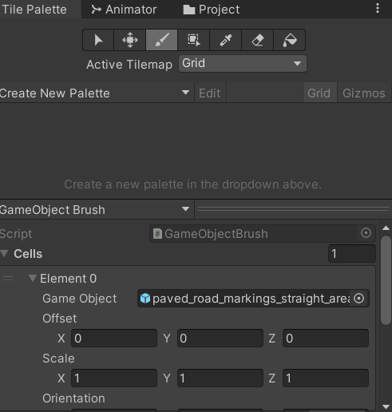
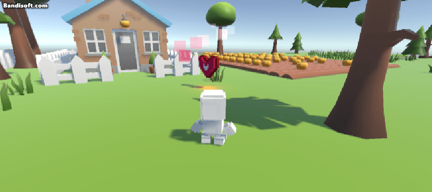

## 3D 타일 맵
- Package Manager - 2D Tilemap Editor,  2D Tilemap Extras 설치
- Hierarchy - 2D Object - Tilemap - Rectangular
- Grid - Cell Swizzle - XZY로 변경 
- Tile Palette - Default Brush를 Game Object Brush로 변경
- Cell의 Element0의 Game Ob에 원하는 타일 가져다 놓기
- 위에 다른 물체를 올리고 싶다면 새로운 레이어 만든 후 Offset Y를 1(혹은 높이만큼)로 변경 


## 물리문제 해결
### 자동 회전 방지
- 외부 충돌에 의해 RigidBody **회전 속력** 발생
```c#
	Rigidbody rigid;
	void Awake()
	{
		rigid = GetComponent<Rigidbody>();
	}
	
    void FreezeRotation()
    {
        // angularVelocity : 물리 회전 속도
        rigid.angularVelocity = Vector3.zero;
    }

    private void FixedUpdate()
    {
        FreezeRotation();
    }
```
### 충돌 레이어 설정
- Inspector - Layer - add Layer - 충동 설정할 Layer 추가
- 오브젝트마다 Layer 변경
- Edit - Project Setting - Physics - Layer Collision Matrix에서 체크로 설정


### 벽 관통 방지
```c#
    bool isObject;
    void Update()
    {
        if (!isObject)
            transform.position += moveVec * speed * (wDown ? 0.3f : 1f) * Time.deltaTime;
    }
    
    void StopToObject()
    {
        // DrawRay() : Scene 내에서 Ray를 보여주는 함수
        Debug.DrawRay(transform.position, transform.forward * 5, Color.green);

        // Raycast() : Ray를 쏘아 닿는 오브젝트를 감지하는 함수
        isObject = Physics.Raycast(transform.position, transform.forward, 5, LayerMask.GetMask("Object"));
    }

    private void FixedUpdate()
    {
        FreezeRotation();
        StopToObject();
    }
```

- 캐릭터 크기를 줄임으로써 속도가 지나치게 빠르면 아무리 설정을 해도 오브젝트를 뚫는다. 속도를 적절히 맞추도록 하자. 크기도. 중력도. 모두 다 노가다가 필요하다ㅠㅠ
- 위의 코드와 별개로 각 물체마다 Box Collider도 적용할 것
<br/>

## 아이템 만들기
1. 만들고 싶은 아이템 가져다 놓기
2. 라이트 이펙트
	- 객체에 Create Empty 생성
	- Add Component - Light 추가
	- Type, Range, Intensity 설정 
3. 파티클 이펙트
	- 객체에 Create Empty 생성
	- Add Component - Particle System 추가
	- Renderer - Material - Default-Line 혹은 Defult-Particle System 으로 설정
	- Emission : 파티클 입자 출력양 / 10로 설정
	- Shape : 파티클 입자 모양 / Cone, Rotation x축 -90 설정
	- Color Over LifeTime : 시간에 따른 색상 변화
	- Size of LifeTime : 시간에 따른 크기 변화
	- Limit Velocity over LifeTime : 시간에 따른 속도 제한 
		- Drag 값 변경
	- Start Life Time : 입자 생존 시간 
		- `Random Between two Constants` 설정 후 2~5
	- Start Speed : 입자 시작 속도
		- `Random Between two Constants` 설정 후 3~5
4. 로직 구현
- Add Component - Rigidbody 
- Add Component - Sphere Collider 추가 (2개)
- Sphere Collider 하나에만 `is Trigger` 체크 후 범위 설정
```c#
public class Item : MonoBehaviour
{
    public enum Type
    {
        Heart
    }

    // 아이템 종류와 값을 저장할 변수 선언
    public Type type;
    public int value;

    // Start is called before the first frame update
    void Start()
    {
        
    }

    // Update is called once per frame
    void Update()
    {
        transform.Rotate(Vector3.up * 20 * Time.deltaTime);
    }
}
```
- 태그 `Item` 지정 
- value는 1로 지정
- 후에 프리팹 저장 부분 추가 할 것 

